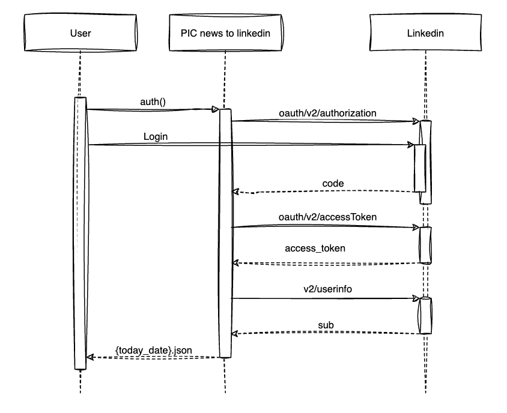

# Pensieriincodice - News to Linkedin

Il progetto ha lo scopo di pubblicare le news di PIC sull'account Linkedin del podcast.

Le news vengono prelevate da Readwise. 


## Autenticazione

Purtroppo le API di Linkedin non restituiscono un `refresh_token` e per ottenere ogni volta un `access_token`
c'è bisogno dell'interazione utente che inserisca manualmente i dati di accesso.

L'`access_token` ha validità 60 giorni.


### Flusso 



Per l'autenticazione è necessario avviare lo script `auth.py`.

Verrà aperta una finestra del browser dove chiederà all'utente di inserire username e password dell'account Linkedin.

Una volta che l'utente ha effettuato il login, il browser si chiuderà automaticamente
e verrà memorizzato in un file json denominato `{today_date}.json` 
(ad es. `2024-10-04.json`) l'`access_token` e il `personal_urn` (id) dell'utente.

Queste informazioni dovranno essere aggiornate nei secrets di github per poter far funzionare l'automazione.


## Installazione in locale


### Variabili di ambiente

Nel file `.env.example` ci sono le variabili di ambiente che devi compilare per completare l'autenticazione,
puoi impostarle nel tuo IDE o nel sistema operativo in esecuzione.

Le variabili necessarie l'autenticazione sono 3:

```
CLIENT_ID="<LINKEDIN_CLIENT_ID_HERE>"
CLIENT_SECRET="<LINKEDIN_CLIENT_SECRET_HERE>"
READWISE_ACCESS_TOKEN="<READWISE_ACCESS_TOKEN_HERE>"
```

Le seguenti variabili sono opzionali perchè hanno nel codice un valore di default: 

```
CALLBACK_URL_PORT="8000"
CALLBACK_URL_PROTOCOL="http"
CALLBACK_URL="localhost"
SCOPE="w_member_social openid profile"
```

Mentre le seguenti variabili:

```
ACCESS_TOKEN=<ACCESS_TOKEN_HERE>
PERSONAL_URN=<PERSONAL_URN_HERE>
LINKEDIN_MESSAGE_TEMPLATE="{title}\n{notes}\n\n{link}"
```

sono da inserire solo sul repo per consentire alla action di github di eseguire la pubblicazione.

Infine se vuoi che lo script di autenticazione sincronizzi automaticamente via API il 
tuo `access_token` ed il tuo `personal_urn` senza che tu debba farlo manualmente ti basta inserire la 
variabile di ambiente `GH_CSV`.

Nella variabile `GH_CSV` devi inserire sotto forma di CSV le seguenti informazioni:
- proprietario del repository
- nome del repository
- token (puoi generare un token di GitHub seguendo questa procedura: https://docs.github.com/en/authentication/keeping-your-account-and-data-secure/managing-your-personal-access-tokens)

Puoi inserire più repository inserendo il separatore `\n` dopo ogni repository, ad es.

```
GH_CSV="<owner>,<repo_name>,<token>\n<owner>,<repo_name>,<token>"
```


### Installazione dei requirements

Per installare le dipendenze di progetto lancia il seguente comando:

```bash
pip install -r requirements.txt
```


### Avvia il processo di autenticazione

Per avviare il processo di autenticazione:

```bash
python auth.py
```

Inserisci le credenziali Linkedin nel browser che ti apparirà e attendi la chiusura del browser.
